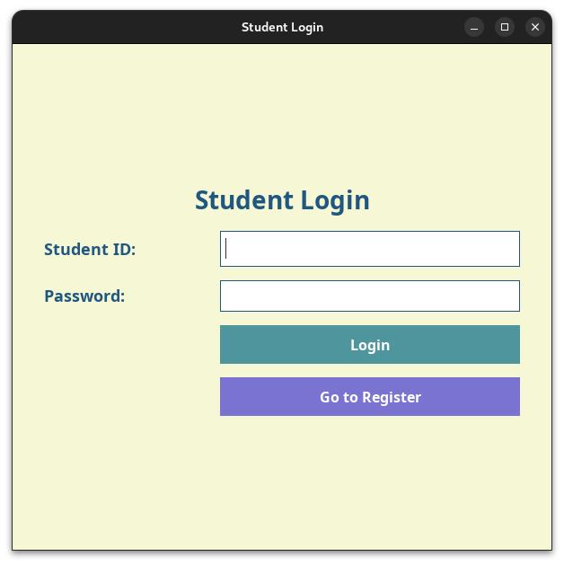
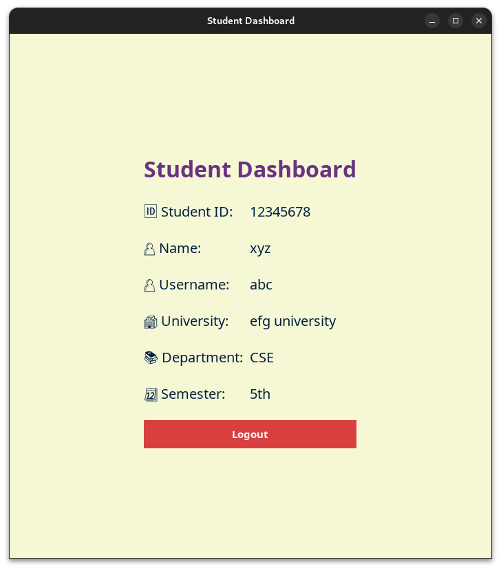
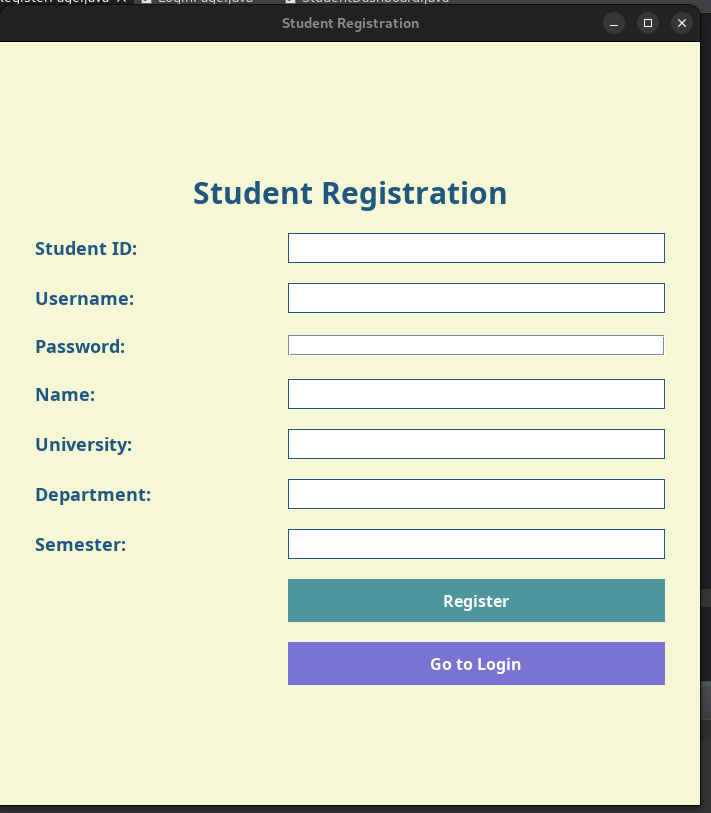

# 🎓 Student Registration & Login System (Java Swing)

A lightweight desktop application built using **Java Swing** that allows students to register, log in securely, and view their biodata through a personal dashboard.

---

## 🚀 Features

* **Student Registration** with unique Student ID and password
* **Secure Login Authentication**
* **Student Dashboard** displaying registered biodata
* **SQLite Database (`students.db`)** for storing student records
* Beginner-friendly UI built with **Java Swing**

---

## 🗂 Project Structure

```
studentlogin/
│── bin/
│   └── studentlogin/
│       ├── DatabaseManager.class
│       ├── LoginPage.class
│       ├── RegisterPage.class
│       ├── StudentDashboard.class
│
│── src/
│   └── studentlogin/
│       ├── DatabaseManager.java
│       ├── LoginPage.java
│       ├── RegisterPage.java
│       ├── StudentDashboard.java
│
│── students.db
│── README.md
```

---

## 🛠 Tech Stack

| Component      | Technology                                                |
| -------------- | --------------------------------------------------------- |
| Language       | Java                                                      |
| UI Framework   | Swing (JFrame, JPanel, JLabel, JTextField, JButton, etc.) |
| Database       | SQLite                                                    |
| Authentication | Student ID + Password                                     |

---

## 📚 Learning Outcomes

Through building this project, I gained hands-on experience in:

* Implementing **user authentication** in Java
* Designing functional UIs using **Java Swing**
* Connecting Java applications with **SQLite database**
* Debugging, fixing UI bugs, and improving workflow through experimentation

---

## ▶ How to Run the Project

1. Clone the repository:

```bash
git clone https://github.com/nilanjanajui/Student-Login-System.git
```

2. Open the project in any Java IDE (Eclipse, IntelliJ, NetBeans, VS Code)
3. Add **SQLite JDBC** to classpath if required
4. Run the application:

```bash
src/studentlogin/LoginPage.java
```

---

## 📸 Preview






---

## 🤝 Contributing

Suggestions and improvements are welcome! Feel free to open an **issue** or submit a **pull request**.

---

## 📝 License

This project is open-source and available under the **MIT License**.
